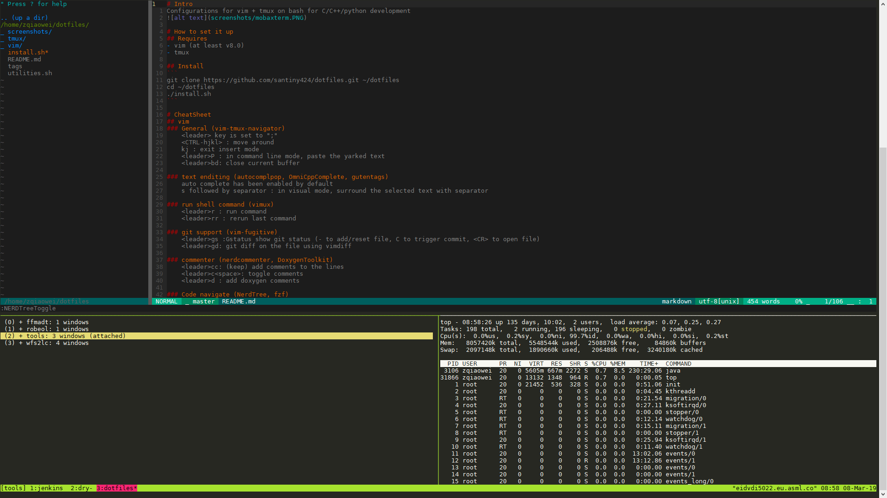

# Intro
Configurations for vim + tmux on bash for C/C++/python development


# How to set it up
## Requires
- vim (at least v8.0)
- tmux

## Install
```
git clone https://github.com/santiny424/dotfiles.git ~/dotfiles
cd ~/dotfiles
./install.sh
```

# CheatSheet
## vim
### General
    <leader> key is set to ";"
    <C-hjkl> : move around
    kj : exit insert mode
    <leader>P : in command line mode, paste the yarked text
    s followed by separator : in visual mode, surround the selected text with separator

### run shell command
    <leader>r : run command
    <leader>rr : rerun last command

### git support
    <leader>gs :Gstatus show git status (- to add/reset file, C to trigger commit, <CR> to open file)
    <leader>gd: git diff on the file using vimdiff

### commenter
    <leader>cc: (keep) add comments to the lines
    <leader>c<space>: toggle comments
    <leader>d : add doxygen comments

### file browser
    <F2> : open/close NERDTree
    <F3> : find the current file in the tree
    R : refresh the whole tree
    m : open up menu

### vimdiff
    ]c : next difference
    [c : previous difference
    do : diff obtain from the other file
    dp : diff put to the other file
    zo : open folded text
    zc : close folded text
    :diffupdate : reload files

## tmux
### General
    prefix is set to <C-a>
    prefix + ? : list all available commands

### Session
    tmux new -s session_name (prefix :new)
        creates a new tmux session named session_name
    prefix + $ : rename current session
    tmux a -t session_name
        attaches to an existing tmux session named session_name
    tmux switch -t session_name (prefix + s)
        switches to an existing session named session_name
    tmux ls
        lists existing tmux sessions
    tmux detach (prefix + d)
        detach the currently attached session

### Windows(prefix +)
    c : create
    k : kill window
    , : rename window
    number : go to <num> window

### Panes(prefix +)
    | : vertical split
    - : horizontal split
    x : kill
    z : zoom in/out
    Ctrl + <arrow> (keep pressing Ctrl): resize the current pane

### Copy mode
    prefix + [ : enter copy mode (navigate using vim keys)
    v: start to make a selection
    y: yank to default tmux buffers and exit copy mode
    prefix + ] : paste the text in the terminal

# TODO
## code snipet
## change Vundle to vim-plug
## auto complete engine (async)

# References
- Tmux
  https://robots.thoughtbot.com/a-tmux-crash-course
- exvim
  https://exvim.github.io/
- use vim as IDE
  https://github.com/yangyangwithgnu/use_vim_as_ide
